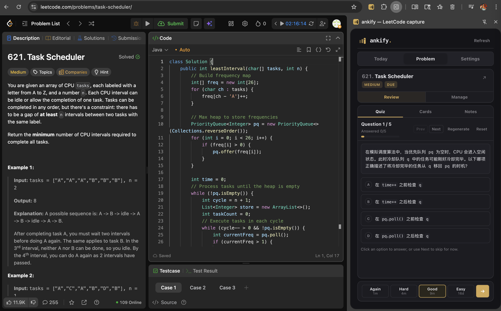
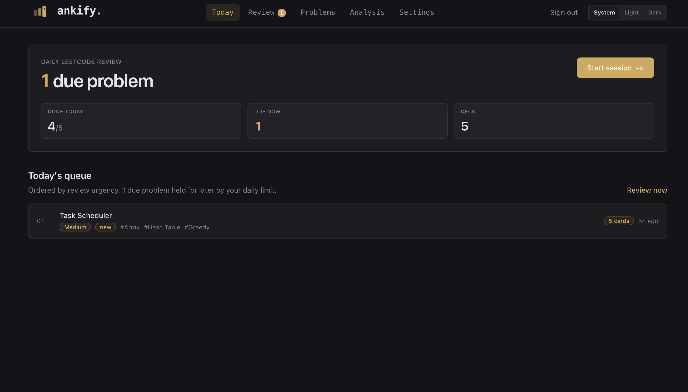
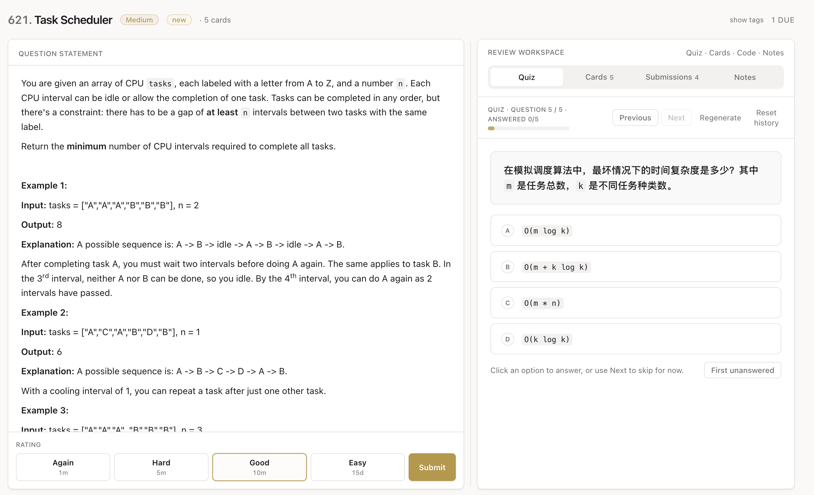
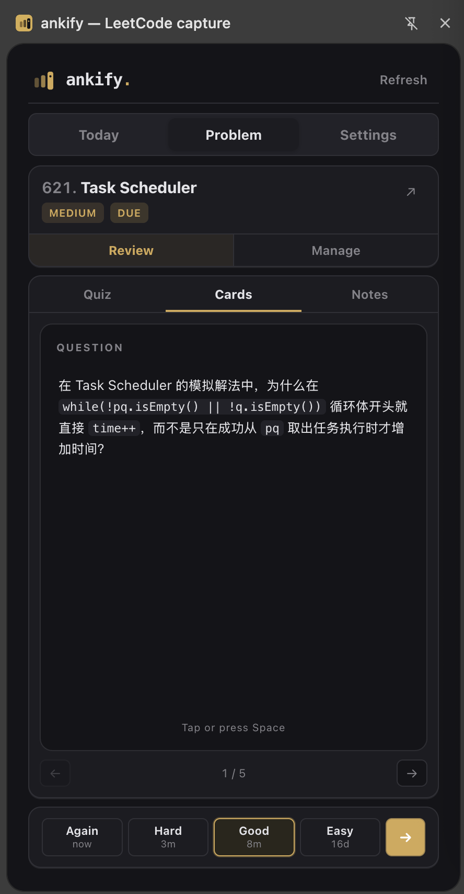
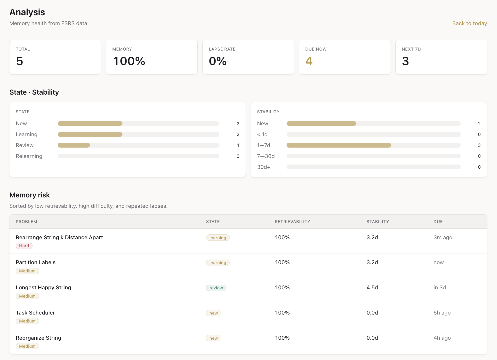

# ankify

> Spaced repetition for the LeetCode problems you actually solve.

Every problem you grind on LeetCode comes with three things you'll forget within a week: the trick that finally made it click, the edge case that broke your first solution, and the complexity argument you handwaved past. ankify captures all three the moment you submit, then quietly brings them back at the right moment so they stick.

It's two surfaces against one shared deck:

- a **web app** for daily review, full-screen quizzes, flashcards, notes, and an FSRS-6 memory dashboard
- a **Chrome extension** that lives next to LeetCode, captures the problem + your submissions in one click, and lets you do quick reviews without leaving the page



---

## Why it exists

Anki is great at vocabulary; it's terrible at "how do I think about this problem". LeetCode tracks what you've solved; it doesn't help you remember it three weeks later. ankify sits between them:

- **Whole-problem scheduling, not whole-deck mush.** FSRS-6 schedules each *problem*, not each card. When `Task Scheduler` is due, you see one focused review session for it: statement, your past code, your notes, and a fresh quiz — not 12 disconnected cards.
- **AI-built quizzes from your own context.** Quiz questions are generated from the actual problem statement, *your* failed submissions, *your* notes, and *your* saved cards. Hard problems get questions about the recurrence; problems you keep failing get edge-case questions.
- **Capture-by-click.** The Chrome extension reads the LeetCode page directly — title, statement, your accepted *and* failed submissions, the failing test cases, expected vs. actual output. No copy-paste.
- **Bring your own LLM.** Anthropic, OpenAI, DeepSeek (more OpenAI-compatible providers slot in trivially). Keys are encrypted before they touch the database.

---

## What it looks like

### 1 · Daily review queue

Open the dashboard and the system tells you exactly how many problems are due today, how many you've already cleared, and ranks the queue by review urgency.



### 2 · Focused review workspace

Click `Start session` (or `Review now` from the queue) and you land on a split-pane workspace: the problem statement on the left, your review tools on the right. Tabs for Quiz, Cards, Submissions, and Notes — everything about this problem in one place. Rate at the bottom and FSRS schedules the next visit.



The quiz on the right is freshly generated for this session — five focused multiple-choice questions covering the approach, invariants, edge cases, complexity, and any failed submissions you've made. The system requires at least four different question scopes per batch and at least one complexity question, so quizzes don't degenerate into trivia.

### 3 · One-click capture from LeetCode

Open the extension on any LeetCode problem page. It scrapes the title, statement, and every accepted and failed submission you've made — code, runtime, and the actual failing test case — and sends it to your deck. From the same panel you can review the problem without ever switching tabs.



The popup mirrors the web app: Quiz / Cards / Notes tabs, a rating bar, and a `Refresh` button. Notes save locally first so typing is never blocked on the network.

### 4 · Memory dashboard, not just a spreadsheet

`/analysis` is built on the same FSRS state that schedules your reviews. It shows total memory health, lapse rate, what's about to slip out of memory, and a per-problem risk table sorted by retrievability — so you can see *which* problems are about to be forgotten, not just *how many* are due.



---

## How it works

| Layer | What |
| --- | --- |
| Scheduling | [`ts-fsrs`](https://github.com/open-spaced-repetition/ts-fsrs) FSRS-6, state stored on the `problems` row. Cards and quizzes feed recall but only the problem is scheduled. |
| AI | Vercel AI SDK with Claude, OpenAI, DeepSeek (V4 thinking + non-thinking), or any OpenAI-compatible provider. User-supplied keys, encrypted at rest with AES-256-GCM. |
| Capture | Content script on `leetcode.com/problems/*` reads the GraphQL endpoint for problem + submission detail. |
| Auth | Better Auth + Google OAuth, email allowlist on signup. The extension authenticates with per-user API tokens (`x-ankify-token`) instead of OAuth. |
| Data | Turso / libSQL for production, local SQLite for dev. Drizzle ORM. Every business table scoped by `userId`. |
| Web + API | Next.js 16 App Router, TypeScript, Tailwind. |
| Extension | Chrome MV3, Vite, React. |

**Cards** are intentionally minimal: just `question` and `answer`. AI generates *candidate* cards which you confirm into *ready* cards. Manual cards skip the candidate step. Saving a missed quiz item as a card is one click.

**Quizzes** are per-problem sessions of exactly 5 multiple-choice questions. The model emits the correct option as literal text (not an integer index), which the server maps back — eliminates off-by-one mistakes that plague index-based MCQ schemas. Sessions can be archived, regenerated, or fully reset (wiping history) so the next batch starts from a clean prompt.

---

## Quick start (local dev, SQLite)

```bash
pnpm install
cp .env.example .env.local        # local profile (SQLite + localhost auth)
pnpm db:migrate                    # creates packages/db/local.db
pnpm dev                           # http://localhost:3000
pnpm dev:ext                       # extension watch build
```

Fill `.env.local` with Better Auth + Google OAuth credentials, an email allowlist, and `AI_KEY_ENCRYPTION_SECRET`. Leave `TURSO_*` empty so the app uses the local SQLite. AI provider keys are saved per-user from the Settings page, never read from server env vars.

Load the unpacked extension from `apps/extension/dist/` (`chrome://extensions` → Developer mode → Load unpacked). Set the extension's API base URL to `http://localhost:3000` and paste a token generated in web Settings.

## Two profiles, two scripts, no accidents

The repo separates the local dev profile from the production profile so a `db:migrate` in dev can never accidentally hit Turso, and vice versa.

| Profile | DB | Auth URL | Env file | Used by |
| --- | --- | --- | --- | --- |
| `local` (default) | SQLite at `LOCAL_DB_PATH` | `http://localhost:3000` | `.env.local` | `pnpm dev`, `db:migrate`, `db:studio`, `db:generate` |
| `production` | Turso (`TURSO_DATABASE_URL`) | your Vercel URL | `.env.production.local` | `db:migrate:prod`, `db:studio:prod` |

`pnpm dev` always runs against `local`. Production is served by Vercel using env vars from the Vercel dashboard. The `.env.production.local` file is only needed when running prod migrations from your laptop — it must not be committed. `AI_KEY_ENCRYPTION_SECRET` in that file MUST match the value set on Vercel; rotating it orphans every encrypted AI key in the prod DB.

## Deploy to Vercel

Use Turso for production. Do not deploy with local SQLite on Vercel.

1. Create a Turso database and token.
2. Set the following Vercel environment variables (Production + Preview):
   - `TURSO_DATABASE_URL`, `TURSO_AUTH_TOKEN`
   - `BETTER_AUTH_SECRET`, `BETTER_AUTH_URL`
   - `GOOGLE_CLIENT_ID`, `GOOGLE_CLIENT_SECRET`
   - `ANKIFY_ALLOWED_EMAILS`
   - `AI_KEY_ENCRYPTION_SECRET`
3. Run the first migration against Turso from your laptop:
   ```bash
   pnpm db:migrate:prod
   ```
   After that, every Vercel deploy auto-runs the migration before `next build` (see the `vercel-build` script in `apps/web/package.json`). Drizzle's migration ledger keeps it idempotent — unchanged schema is a no-op.
4. Import the repo on Vercel as a monorepo project with root directory `apps/web`. Build command `pnpm build`, install command `pnpm install --frozen-lockfile`. Vercel picks up `vercel-build` automatically.
5. Add OAuth redirect URIs in Google Cloud Console:
   - local: `http://localhost:3000/api/auth/callback/google`
   - production: `https://your-domain.com/api/auth/callback/google`
6. Sign in with an allowlisted Google email, save your AI provider/model/key in Settings, generate an extension API token.
7. In the Chrome extension settings, point API Base URL at your Vercel URL, paste the token, click `Test connection`.

The web UI uses Better Auth Google sessions; the extension never performs OAuth and only sends the per-user API token as `x-ankify-token`.

---

## Layout

```text
apps/
  web/          Next.js dashboard, API, review workspace, FSRS analysis
  extension/    Chrome MV3 extension for LeetCode capture and quick review
packages/
  db/           Drizzle schema, migrations, libSQL client, profile-aware loader
  core/         FSRS-6 wrapper, shared Zod schemas, AI generation contracts
```

## Tables

- `user`, `session`, `account`, `verification`: Better Auth.
- `apikey`: Better Auth API-key plugin (extension tokens).
- `problems`: LeetCode problem metadata, notes, archived flag, FSRS state.
- `submissions`: captured accepted and failed submissions.
- `cards`: flashcards and AI candidates (`ai_status`: `candidate | failed | ready`).
- `quiz_sessions`: active / completed / archived quiz JSON plus answers and score.
- `review_events`: append-only event log feeding the analysis dashboard.
- `settings`: per-user key/value settings (encrypted AI keys, daily review limit).

All user-owned business data carries `userId`. `problems.leetcodeSlug` and `leetcodeId` are unique per user, not globally.

After schema changes:
```bash
pnpm db:generate     # generate migration files
pnpm db:migrate      # apply locally
pnpm db:migrate:prod # apply to Turso (also auto-runs on Vercel deploy)
```

## Verification

```bash
pnpm typecheck
pnpm lint
pnpm build
```
