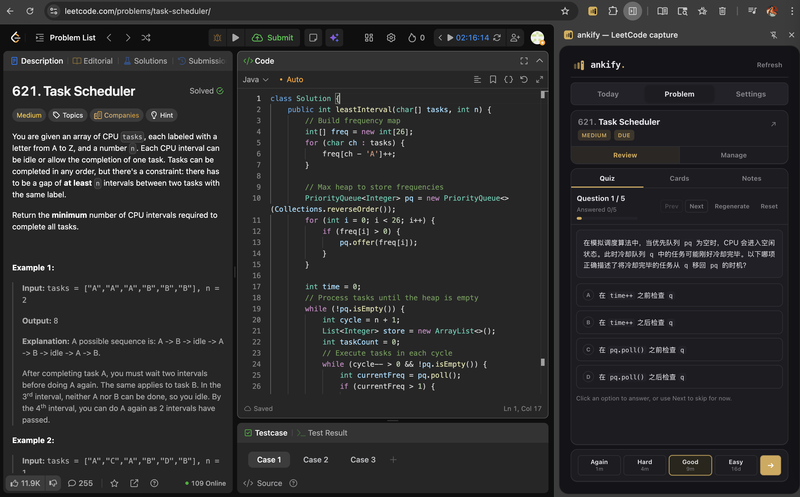
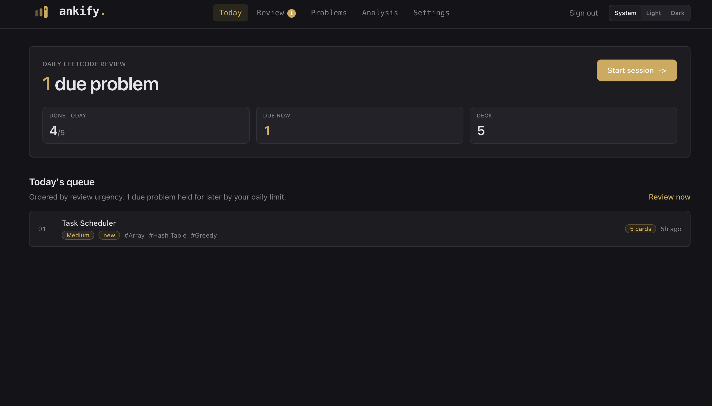
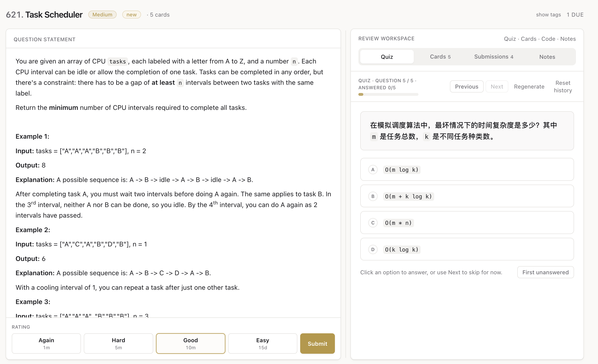
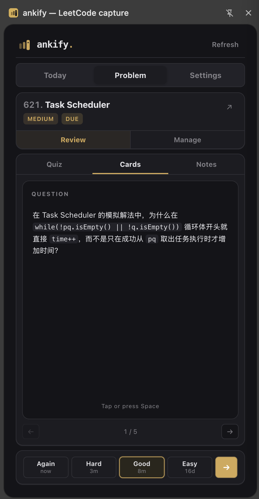
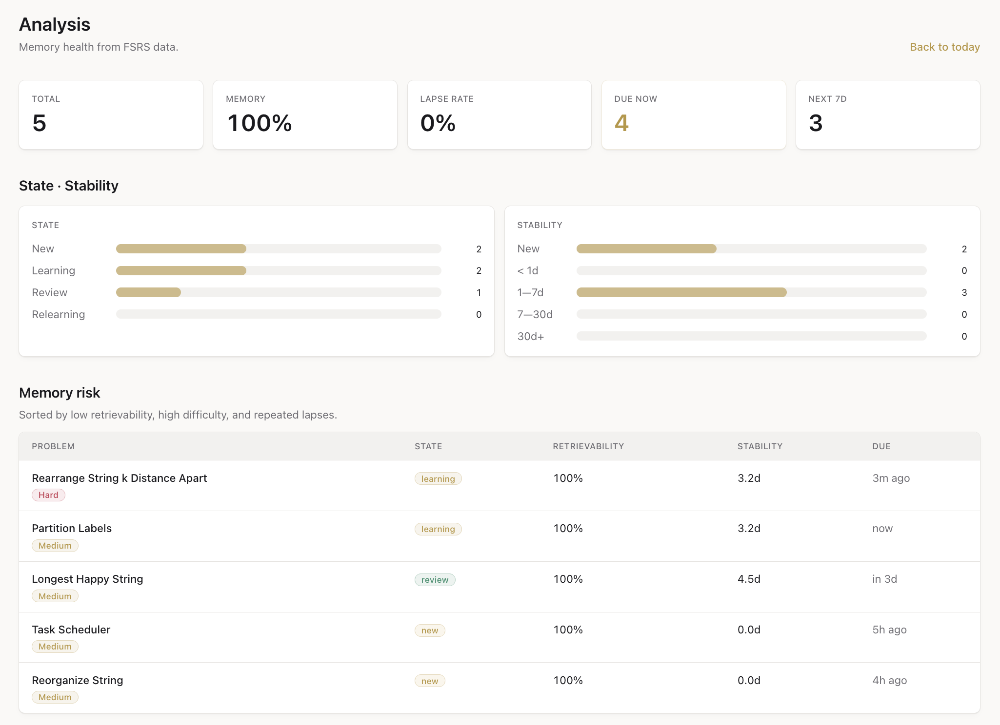

# ankify

> Spaced repetition for the LeetCode problems you actually solve.

Every problem you grind on LeetCode comes with three things you'll forget within a week: the trick that finally made it click, the edge case that broke your first solution, and the complexity argument you handwaved past. ankify captures all three the moment you submit, then quietly brings them back at the right moment so they stick.

It's two surfaces against one shared deck:

- a **web app** for daily review, full-screen quizzes, flashcards, notes, and an FSRS-6 memory dashboard
- a **Chrome extension** that lives next to LeetCode, captures the problem + your submissions in one click, and lets you do quick reviews without leaving the page



---

## Why it exists

Anki is great at vocabulary; it's terrible at "how do I think about this problem". LeetCode tracks what you've solved; it doesn't help you remember it three weeks later. ankify sits between them:

- **Whole-problem scheduling, not whole-deck mush.** FSRS-6 schedules each *problem*, not each card. When `Task Scheduler` is due, you see one focused review session for it: statement, your past code, your notes, and a fresh quiz — not 12 disconnected cards.
- **AI-built quizzes from your own context.** Quiz questions are generated from the actual problem statement, *your* failed submissions, *your* notes, and *your* saved cards. Hard problems get questions about the recurrence; problems you keep failing get edge-case questions.
- **Capture-by-click.** The Chrome extension reads the LeetCode page directly — title, statement, your accepted *and* failed submissions, the failing test cases, expected vs. actual output. No copy-paste.
- **Bring your own LLM.** Anthropic, OpenAI, DeepSeek (more OpenAI-compatible providers slot in trivially). Keys are encrypted before they touch the database.

---

## What it looks like

### 1 · Daily review queue

Open the dashboard and the system tells you exactly how many problems are due today, how many you've already cleared, and ranks the queue by review urgency.



### 2 · Focused review workspace

Click `Start session` (or `Review now` from the queue) and you land on a split-pane workspace: the problem statement on the left, your review tools on the right. Tabs for Quiz, Cards, Submissions, and Notes — everything about this problem in one place. Rate at the bottom and FSRS schedules the next visit.



The quiz on the right is freshly generated for this session — five focused multiple-choice questions covering the approach, invariants, edge cases, complexity, and any failed submissions you've made. The system requires at least four different question scopes per batch and at least one complexity question, so quizzes don't degenerate into trivia.

### 3 · One-click capture from LeetCode

Open the extension on any LeetCode problem page. It scrapes the title, statement, and every accepted and failed submission you've made — code, runtime, and the actual failing test case — and sends it to your deck. From the same panel you can review the problem without ever switching tabs.



The popup mirrors the web app: Quiz / Cards / Notes tabs, a rating bar, and a `Refresh` button. Notes save locally first so typing is never blocked on the network.

### 4 · Memory dashboard, not just a spreadsheet

`/analysis` is built on the same FSRS state that schedules your reviews. It shows total memory health, lapse rate, what's about to slip out of memory, and a per-problem risk table sorted by retrievability — so you can see *which* problems are about to be forgotten, not just *how many* are due.



---

## How it works

| Layer | What |
| --- | --- |
| Scheduling | [`ts-fsrs`](https://github.com/open-spaced-repetition/ts-fsrs) FSRS-6, state stored on the `problems` row. Cards and quizzes feed recall but only the problem is scheduled. |
| AI | Vercel AI SDK with Claude, OpenAI, DeepSeek (V4 thinking + non-thinking), or any OpenAI-compatible provider. User-supplied keys, encrypted at rest with AES-256-GCM. |
| Capture | Content script on `leetcode.com/problems/*` reads the GraphQL endpoint for problem + submission detail. |
| Auth | Better Auth + Google OAuth with public signup. The extension reuses the same secure web session, so users never create or paste a separate token. |
| Data | Turso / libSQL for production, local SQLite for dev. Drizzle ORM. Every business table scoped by `userId`. |
| Web + API | Next.js 16 App Router, TypeScript, Tailwind. |
| Extension | Chrome MV3, Vite, React. |

**Cards** are intentionally minimal: just `question` and `answer`. AI generates *candidate* cards which you confirm into *ready* cards. Manual cards skip the candidate step. Saving a missed quiz item as a card is one click.

**Quizzes** are per-problem sessions of exactly 5 multiple-choice questions. The model emits the correct option as literal text (not an integer index), which the server maps back — eliminates off-by-one mistakes that plague index-based MCQ schemas. Sessions can be archived, regenerated, or fully reset (wiping history) so the next batch starts from a clean prompt.

---

## Quick start (local dev, SQLite)

```bash
pnpm install
cp .env.example .env.local        # local profile (SQLite + localhost auth)
pnpm db:migrate                    # creates packages/db/local.db
pnpm dev                           # http://localhost:3000
pnpm dev:ext                       # extension dev server with HMR
```

Fill `.env.local` with Better Auth + Google OAuth credentials and `AI_KEY_ENCRYPTION_SECRET`. Leave `TURSO_*` empty so the app uses the local SQLite. AI provider keys are saved per-user from the Settings page, never read from server env vars.

Load the unpacked extension from `apps/extension/dist/` (`chrome://extensions` → Developer mode → Load unpacked). Set the extension's API base URL to `http://localhost:3000`, sign into the web app with Google, and open the extension. It detects the shared session automatically.

Use `pnpm dev:ext` while editing the extension so CRXJS can refresh extension pages and content scripts. After a production `pnpm build`, reload Ankify once in `chrome://extensions`, then refresh any already-open LeetCode tabs; production builds replace hashed content-script files.

## Isolated local, Preview, and Production profiles

The repo separates local development, Vercel Preview, and Production so a local
command cannot silently fall back to or mutate a deployed database.

| Profile | DB | Auth URL | Env file | Used by |
| --- | --- | --- | --- | --- |
| `local` (default) | SQLite at `LOCAL_DB_PATH` | `http://localhost:3000` | `.env.local` | `pnpm dev`, `db:migrate`, `db:studio`, `db:generate` |
| `preview` | dedicated Preview Turso DB | stable Preview branch domain | `.env.preview.local` | `db:migrate:preview`, `db:studio:preview` |
| `production` | Turso (`TURSO_DATABASE_URL`) | your Vercel URL | `.env.production.local` | `db:migrate:prod`, `db:studio:prod` |

`pnpm dev` always runs against `local`. Vercel reads its runtime variables from
the dashboard; the two deployed `.env.*.local` files are only for explicitly
running migrations from your laptop and must never be committed. Each
environment needs its own database, auth secret, and encryption secret.
`AI_KEY_ENCRYPTION_SECRET` must remain stable within one database; losing or
rotating it without re-encryption orphans every stored AI key.

## Deploy to Vercel

Use Turso for production. Do not deploy with local SQLite on Vercel.

1. Create a Turso database and token.
2. Configure **Production** variables in Vercel:
   - `TURSO_DATABASE_URL`, `TURSO_AUTH_TOKEN`
   - `BETTER_AUTH_SECRET`, `BETTER_AUTH_URL`
   - `GOOGLE_CLIENT_ID`, `GOOGLE_CLIENT_SECRET`
   - `AI_KEY_ENCRYPTION_SECRET`
   - `ANKIFY_DEPLOYMENT_ENV=production`
   - `ANKIFY_EXTENSION_ORIGINS=chrome-extension://<extension-id>`
   - Public Google signup is on by default. `ANKIFY_DISABLE_SIGNUP=true` is an
     emergency kill switch for new accounts; existing users can still sign in.
3. Configure the same names under **Preview**, but use a separate Turso
   database, separate secrets, `ANKIFY_DEPLOYMENT_ENV=preview`, a stable Preview
   branch domain for `BETTER_AUTH_URL`, and normally
   `ANKIFY_DISABLE_SIGNUP=true`. Register that domain's Google callback URL if
   Preview login is required.
4. Before the first Production deployment—and before every deployment that
   contains a new migration—back up and migrate from one controlled terminal:
   ```bash
   pnpm db:release
   ```
   Preview migrations use `pnpm db:migrate:preview`. Database migrations never
   run inside a Vercel build: concurrent or retried builds must remain read-only
   with respect to schema. For breaking schema changes, use an
   expand/deploy/contract sequence.
5. Import the repo on Vercel with root directory `apps/web` and keep
   **Include source files outside the Root Directory** enabled. The committed
   `apps/web/vercel.json` pins the framework, frozen-lockfile install, validated
   build command, and Fluid compute. Node 24 and pnpm 10.25 are pinned from the
   root package metadata.
6. Add OAuth redirect URIs in Google Cloud Console:
   - local: `http://localhost:3000/api/auth/callback/google`
   - production: `https://your-domain.com/api/auth/callback/google`
   Set the Production OAuth audience to External, use the public root page as
   the app homepage, link `/privacy` and `/terms`, and verify the domain.
7. Sign in with any Google account and save your AI provider/model/key in Settings.
8. In the Chrome extension, point API Base URL at your Vercel URL and click
   `Continue with Google`. An existing web login is detected automatically.

The web UI and Chrome extension use the same Better Auth Google session. The
extension sends credentialed requests only to the exact configured API origin;
it does not create or store a separate ankify API token.

Before uploading the extension to the Chrome Web Store, build it with the
Production API origin and use the public policy URL from the deployed web app:

```bash
ANKIFY_EXTENSION_API_ORIGIN=https://your-domain.com pnpm --filter @ankify/extension build
```

- Privacy policy: `https://your-domain.com/privacy`
- Terms: `https://your-domain.com/terms`
- The manifest asks for exact LeetCode and Production API hosts. Any custom API
  origin is requested from Chrome only after the user explicitly saves or tests it.
- Users can export their data as NDJSON and permanently delete their account
  from Settings.

See [`docs/RELEASE_CHECKLIST.md`](docs/RELEASE_CHECKLIST.md) for the complete
Preview-to-Production runbook.

---

## Layout

```text
apps/
  web/          Next.js dashboard, API, review workspace, FSRS analysis
  extension/    Chrome MV3 extension for LeetCode capture and quick review
packages/
  db/           Drizzle schema, migrations, libSQL client, profile-aware loader
  core/         FSRS-6 wrapper, shared Zod schemas, AI generation contracts
```

## Tables

- `user`, `session`, `account`, `verification`: Better Auth.
- `problems`: LeetCode problem metadata, notes, archived flag, FSRS state.
- `submissions`: captured accepted and failed submissions.
- `cards`: flashcards and AI candidates (`ai_status`: `candidate | failed | ready`).
- `quiz_sessions`: active / completed / archived quiz JSON plus answers and score.
- `review_events`: append-only event log feeding the analysis dashboard.
- `settings`: per-user key/value settings (encrypted AI keys, daily review limit).

All user-owned business data carries `userId`. `problems.leetcodeSlug` and `leetcodeId` are unique per user, not globally.

After schema changes:
```bash
pnpm db:generate     # generate migration files
pnpm db:migrate      # apply locally
pnpm db:migrate:preview # apply to the isolated Preview Turso database
pnpm db:release      # back up Production, then apply Production migrations
```

## Verification

```bash
pnpm release:check
```

This runs type checking, lint, tests, all Production builds, and fails on any
high/critical production dependency advisory.
