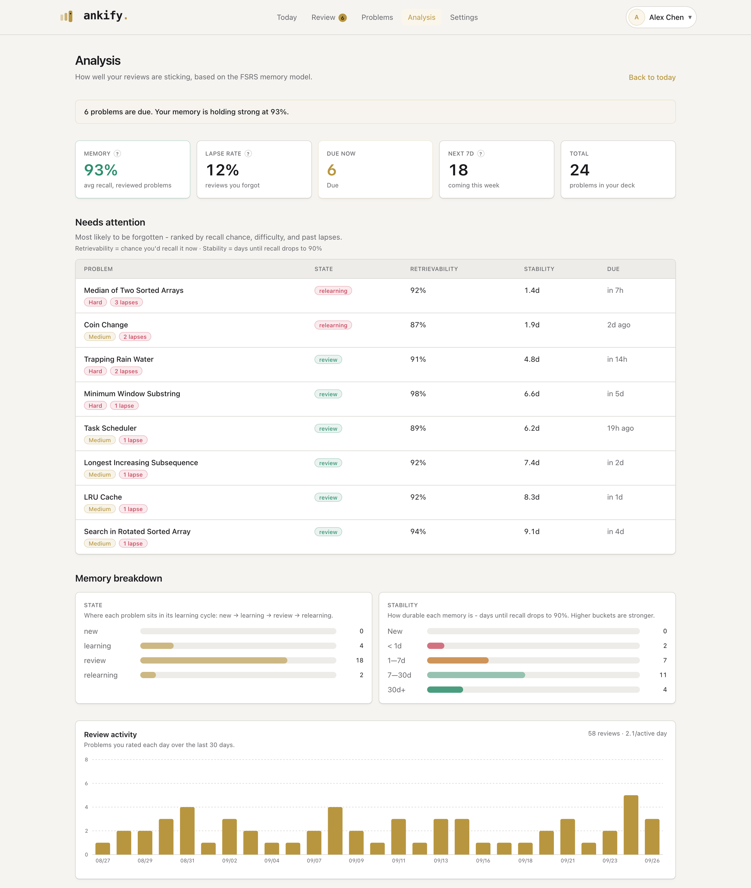

<div align="center">

# ankify

**Remember the reasoning behind every LeetCode problem you solve.**

ankify works next to LeetCode. The Chrome extension records each practice session and its submissions,<br>
FSRS brings every problem back just before you'd forget it, and your mistake profile shows which causes of failure keep coming back.

[**Open the web app**](https://ankify-pi.vercel.app) · [**Add to Chrome**](https://chromewebstore.google.com/detail/ankify/gcldkcaidjnkaagngppblefddapdpaeb) · [Self-host](docs/SELF_HOSTING.md)

</div>

---

## The problem

You solve a problem, move on, and three weeks later you can't remember why the greedy approach failed or which edge case broke your first submission.

- **Re-solving at random** wastes time on problems you still remember and misses the ones you're about to forget.
- **A pile of flashcards** is a poor way to review algorithm problems: the real test is solving the problem again.

ankify schedules the **whole problem** and reviews it the way you learned it: by solving it again on LeetCode.

## How it works

| 1. Practice | 2. Rate | 3. Learn |
| --- | --- | --- |
| Open a problem on LeetCode and click **Start practice** in the ankify panel. Every submission is recorded with its verdict and failing test case. | When a review is due, solve the problem again, finish the session, and rate how it went. FSRS-6 schedules the next review; a first practice comes back a day later. | Record why an attempt failed (or let session analysis suggest a cause) and watch which skills keep slipping across problems. |

## Features

### Practice sessions on LeetCode

The extension tracks the problem in your current tab: when you start, which submissions you make, their verdicts, and how long you actively worked. A due review opened from the toolbar popup starts its session before the page loads. Accepted doesn't end the session; you decide when you're done. Nothing is scheduled until you rate a review.

### A mistake profile, counted per session

Confirmed causes of failure (approach, invariant, edge cases, complexity, implementation, concept) are counted once per practice session, so retrying a problem five times doesn't inflate a weakness. The profile on `/analysis` shows recurring categories, trends, and the sessions behind them. A session you confirm as handled well lowers that category's weakness.

### New problems worth trying

Each day the popup and `/suggestions` offer a problem you haven't attempted, chosen from the similar questions of problems you practiced. Once your profile has enough history, suggestions target your recurring weaknesses. Each one says why it was picked, using only what ankify actually knows; skip it, mark it already attempted, or ask for another.

### Session analysis, with your own key (optional)

After a session, ankify can explain why it went wrong: it reads your attempts, code diffs, and judge output, and suggests mistakes for you to confirm. Nothing counts toward your profile until you do. Analysis runs only on your own Anthropic, OpenAI, DeepSeek, or Google Gemini key, never on a shared one. Keys are encrypted with AES-256-GCM before they reach the database.

### See what's about to slip

`/analysis` also reads the FSRS state that drives your schedule: average recall, lapse rate, a ranked list of the problems you're most likely to forget, stability buckets, and your review history.

<picture>
  <source media="(prefers-color-scheme: dark)" srcset="images/analysis-dark.png">
  
</picture>

### And the rest

- **A dashboard for today.** `/today` shows what's due, overdue, and coming up, your recent practice, and your focus areas.
- **A history for every problem.** Each problem page lists its sessions, its scheduling timeline, your notes, and your submissions.
- **English or 简体中文.** The interface and session analyses each have their own language setting.
- **Your data stays yours.** Export everything as NDJSON or delete your account from Settings.

---

## Get started

1. **Sign in** at [ankify-pi.vercel.app](https://ankify-pi.vercel.app) with Google.
2. **Install the [Chrome extension](https://chromewebstore.google.com/detail/ankify/gcldkcaidjnkaagngppblefddapdpaeb).** It reuses your web login, so there's no token to paste.
3. **Open any LeetCode problem** and click **Start practice** in the ankify panel.
4. *(Optional)* **Add your own AI key** in Settings to analyze finished sessions.

Your first practice comes back for review a day after you finish it.

## Built with

| Layer | Stack |
| --- | --- |
| Scheduling | [`ts-fsrs`](https://github.com/open-spaced-repetition/ts-fsrs) FSRS-6. Each problem is scheduled as one item, rated once per review session. |
| AI | Vercel AI SDK: durable, user-keyed session-analysis jobs on Vercel Queues |
| Web + API | Next.js 16 App Router, TypeScript, Tailwind |
| Extension | Chrome MV3, Vite, React; an IndexedDB outbox keeps work durable offline |
| Data | Drizzle ORM on Turso / libSQL (SQLite locally). Every business table is scoped by `userId`. |
| Auth | Better Auth + Google OAuth. The extension shares the web session. |

## Self-hosting and development

Local setup, the QA and demo environments, database profiles, Vercel deployment, and release checks are covered in **[docs/SELF_HOSTING.md](docs/SELF_HOSTING.md)**. For how the system fits together, start with **[docs/ARCHITECTURE.md](docs/ARCHITECTURE.md)**.

```bash
pnpm install
cp .env.example .env.local
pnpm db:migrate
pnpm dev          # http://localhost:3000
```

Want to look around without setting up Google OAuth? Run `pnpm dev:demo` and open `http://localhost:3000/api/qa/login`.

## License

[MIT](LICENSE)
