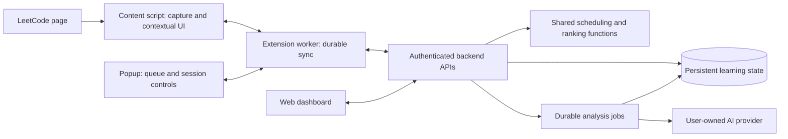

# Ankify Extension-First Refactor

## 1. Decisions, repository findings, and baseline

### Confirmed product decisions

This plan incorporates the choices made during planning:

- The extension is the primary daily interaction surface.
- Opening a scheduled review starts a session. Other problem visits require **Start practice**.
- An Accepted submission shows **Finish**; it does not automatically finish the session.
- Initial learning schedules a first review 24 hours after completion, without a fabricated recall rating.
- Subsequent full-solve reviews use day-based FSRS scheduling.
- Voluntary practice changes the schedule only when explicitly started as **Review early**.
- Automatic AI analysis is opt-in.
- Session analysis requires the user’s own API key. Hosted analysis is excluded from this release.
- New AI-credit purchases are suspended.
- Sparse profiles receive clearly labeled general-practice suggestions.
- There are no current users. Historical Coach, card, and quiz content does not need an archive UI and may be discarded during separately staged cleanup.
- Captured problems, submissions, notes, confirmed mistakes, and FSRS/review history remain protected.

**Execution prerequisite:** reasoning effort must be set to the highest available level in the client before implementation. This agent has not changed or verified that setting. No refactor code was written during this investigation.

### Current architecture assessment

| Area | Confirmed implementation | Refactor treatment |
|---|---|---|
| Extension surface | Manifest V3; toolbar action opens a side panel. `Popup.tsx` contains queue, capture, quizzes, cards, notes, ratings, and settings. | Replace the main surface with a lightweight toolbar popup; extract reusable components and backend client. |
| LeetCode capture | Same-origin GraphQL requests using the browser’s LeetCode session and CSRF cookie. Imports the latest 20 submissions, requesting details with concurrency four. | Retain the integration; add explicit availability states, incremental pagination, and session association. |
| Submission identity | Database uniqueness already exists on user, problem, and LeetCode submission ID. Capture also deduplicates by code/language/verdict. | Remove content-based suppression when stable submission IDs exist. |
| Practice sessions | No practice-session model or lifecycle. | Add an independent domain; do not fabricate sessions from historical imports. |
| FSRS | `ts-fsrs` 5.4.1; problem-level state, 90% retention, fuzz enabled, minute-scale learning steps. | Preserve stored state; introduce a versioned full-solve scheduling policy. |
| Review mutations | Request idempotency, transactionally stored snapshots, optimistic checks using repetition count, and Undo. No session association. | Reuse transaction structure; add session uniqueness and a monotonic scheduling revision. |
| Queue | Due queue, timezone, daily limit, and completion count exist. Queue DTO includes card counts. | Add upcoming/overdue views and pending ratings; preserve the old DTO for old clients. |
| Authentication | Better Auth cookies, fixed extension API origin, credentials included, extension-origin CORS allowlist. | Retain. Move new extension backend communication into trusted extension contexts. |
| Mistake records | Manual logging, ownership validation, candidate/confirmed/dismissed states, source deduplication, export, and tests. | Extend to sessions and structured analysis evidence. |
| Mistake dashboard | Existing `/analysis` is an FSRS dashboard; the planned mistake-profile aggregation/dashboard is not implemented. | Implement from session-aware evidence. |
| Daily feed | Pure, tested weakness/allocation/selection engine. No application persistence, feed API, or feed UI. | Reuse calculations and determinism; replace mixed-item allocation with new-problem recommendations. |
| AI jobs | Durable jobs, encrypted input, queue dispatch, leases, retries, active-resource deduplication, and transactional result commits. | Add session-analysis jobs; retain infrastructure. |
| Legacy AI | Coach execution and card/quiz generation exist. The web quiz panel can automatically generate a first or subsequent batch. | Disable creation and execution server-side, then remove active UI. |
| Billing | Credit balances, ledger, purchases, checkout, and webhook processing exist. | Suspend sales; retain accounting and webhook handling. |
| Testing | Vitest, disposable SQLite DBs, migration tests, isolated concurrency tests, and GitHub Actions. | Extend with session/API tests and extension browser tests. |

Principal implementation references: [capture service](../apps/web/src/server/capture.ts), [FSRS wrapper](../packages/core/src/fsrs.ts), and [schema](../packages/db/src/schema.ts).

The three existing architecture/planning documents remain useful, but their quiz-first review assumptions, mixed feed, and hosted-generation descriptions must be replaced during implementation:

- [Architecture](ARCHITECTURE.md)
- [Mistake Profile](MISTAKE_PROFILE_PLAN.md)
- [Daily Practice Feed](DAILY_FEED_PLAN.md)

### Baseline actually executed

| Check | Result |
|---|---|
| `pnpm test` | **Passed: 205 tests across 34 files** |
| `pnpm typecheck` | **Passed** |
| `pnpm lint` | **Passed with seven existing warnings** |
| Standalone extension production build | **Passed** |
| Extension manifest validation | **Passed** |
| Full production build | **Blocked:** web Turbopack failed while binding a local port, including after an approved retry outside the sandbox |
| Authenticated live LeetCode workflow | **Not executed** |
| Browser end-to-end tests | **Not available in the repository** |
| Repository changes | No tracked changes |

The manifest check initially encountered a missing artifact after the failed parallel build. A standalone extension rebuild followed by manifest validation passed.

**Phase 0 is not complete:** the web production-build gate and live integration validation remain unresolved. Passing unit tests does not override either gate.

### Important constraints discovered

- LeetCode query failures currently collapse into empty submission lists in some paths. An empty list cannot safely establish “never attempted.”
- Capture cannot currently measure editor activity, hints, independent recall, or actual solving time.
- Only `leetcode.com` is supported by the production manifest.
- Submission storage is capped at 500 records per problem. Capacity failures must become explicit synchronization states.
- The FSRS wrapper returns retrievability `1` for new problems; the new dashboard must display this as **not yet estimated**, not proven perfect recall.
- Repetition count alone is insufficient to detect every stale mutation after Undo.
- AI job replay currently retrieves an existing request without universally verifying payload equivalence.
- The AI runner assumes non-card work is quiz work. It must use exhaustive action dispatch before adding analysis jobs.
- Root lint currently runs the web package’s lint script; extension code needs explicit coverage.
- Some architecture prose is stale: actual hosted-credit code can split spending across starter and purchased balances. Preserve tested accounting behavior.
- Chrome service workers can stop and restart; session state cannot depend on their in-memory variables. [Chrome lifecycle documentation](https://developer.chrome.com/docs/extensions/develop/concepts/service-workers/lifecycle)

## 2. Target architecture and domain contracts

### Responsibility boundaries

- **Content script:** observes the current problem, queries LeetCode, and renders compact session controls.
- **Extension worker:** validates messages, manages durable outgoing operations, authenticates backend requests, and coordinates tabs.
- **Popup:** presents reviews, upcoming dates, pending ratings, session status, and the current suggestion.
- **Backend:** owns lifecycle transitions, submission association, scheduling, evidence aggregation, recommendation persistence, and authorization.
- **Shared core:** retains pure scheduling and ranking functions. The extension does not execute authoritative FSRS transitions.
- **Web:** presents Dashboard, History, Mistake Profile, Suggestions, and Settings.

Retain Next.js, Drizzle/libSQL, Better Auth, shared contracts, the existing provider integrations, and Vercel Queues. Do not introduce another application server or scheduling service.

### Practice-session model

Add `practice_sessions` with:

- Owner, problem, stable session ID, creation request ID.
- `type`: `initial_learning | scheduled_review | voluntary_practice`.
- `reviewMethod`: `leetcode_full_solve`.
- `reviewIntent`: `due | early | none`.
- Lifecycle status: `active | interrupted | completed | abandoned`.
- Start, last-observed, completion, and server-received timestamps.
- Outcome: `accepted | failed | unknown`; interruption and abandonment remain lifecycle states.
- Session revision and scheduling revision observed at start.
- Rating disposition: `not_applicable | pending | deferred | submitted | dismissed | expired | superseded | undone`.
- Capture completeness and timing quality.
- Optional recommendation association.
- Source-site/account identity when verifiable.

**“Initial learning” means first tracked enrollment in Ankify**, not a claim that the user has never encountered the problem.

Add `practice_session_submissions` to associate observed submission identities with a session. This table also retains submission-list observations when code details are unavailable:

- Owner, session, problem.
- LeetCode submission ID when available.
- Stable client observation ID for ID-less observations.
- Nullable link to the existing `submissions` row.
- Observed verdict, source timestamp, first observation time.
- Detail-fetch status and association provenance.

This avoids inventing empty code records when LeetCode exposes a verdict but fails to return source code.

Constraints:

- One open session per user/problem, including interrupted sessions.
- A stable LeetCode submission identity belongs to at most one practice session per user/site.
- Every linked submission and session must belong to the same user and problem.
- Session commands require idempotency keys and validated payload equivalence.
- Historical submissions remain unassigned unless new, unambiguous evidence establishes an association.

### Session lifecycle

| Event | Behavior |
|---|---|
| Open review from queue | Backend creates or resumes one review session before navigation. |
| Browse another problem | Show status and Start practice; create no session automatically. |
| Start new-problem practice | Create initial-learning session and a problem awaiting enrollment completion. |
| Start existing-problem practice | Create voluntary session unless the user explicitly chooses due/early review. |
| Accepted submission | Update evidence and show Finish; keep the session active. |
| Finish without Accepted | Complete with failed/unknown outcome; review sessions may still receive Again. |
| Abandon | End without a rating or scheduling change. |
| Reload | Restore the same session from backend and durable local state. |
| Browser closure | Mark interrupted when next reconciled; never infer failure or submit a rating. |
| Resume interrupted session | Reuse its ID within 24 hours of last activity. |
| Session stale beyond 24 hours | Retain as interrupted history, release its open-session slot, and require a new session. |
| Start another session while a prior rating is pending | Explicitly supersede the pending rating; preserve the unrated history. |

An interrupted session is not scored as a failed attempt. The user must explicitly finish a review as unsuccessful before its failure becomes a review outcome.

### Timing and multiple tabs

- Store elapsed wall time separately from estimated foreground activity.
- Estimate activity only from bounded foreground/visibility intervals; do not inspect or record keystrokes.
- Exclude unobserved gaps from activity estimates.
- Display **estimated active time** and a completeness indicator. Never label it actual solving time.
- Use a session owner token and short renewable ownership lease for competing tabs.
- A second tab shows the existing session and an explicit **Continue here** action.
- Taking over changes the owner token; stale tabs cannot finish or rate the session.
- All tabs may report stable submission observations, but the backend deduplicates them and checks association.
- Ambiguous observations remain unassigned and are offered for explicit association rather than guessed.

### Submission ingestion

1. Preserve every distinct stable LeetCode submission ID, including identical code/verdict combinations.
2. Repeated delivery of the same identity enriches missing details without creating another submission.
3. Conflicting problem/account identity returns a conflict; never silently reassign.
4. ID-less legacy imports retain conservative deduplication and remain distinguishable from reliably identified attempts.
5. New ID-less observations use durable client IDs, not code hashes as identity.
6. Capture batches remain bounded at 20; incremental pagination collects additional batches.
7. Return accepted, duplicate, pending-detail, ambiguous, and capacity-blocked outcomes explicitly.
8. Storage-cap failures retain unsynchronized local operations and show a recoverable error; no automatic pruning of learning history.
9. Recapture never writes FSRS state.

### FSRS policy

Add a versioned policy: `leetcode_full_solve_v1`.

- Keep 90% retention and existing FSRS weights/fuzz.
- Disable short-term learning steps for session-based full-solve ratings.
- Do not manually rewrite FSRS’s resulting day intervals.
- Preserve all existing stored schedules during migration.
- Record policy version and review method on every new scheduling event.

The installed library supports disabling short-term steps. A read-only probe confirmed that it produces day-based first-review outcomes.

**Initial learning**

- New session-created problems are excluded from the due queue while awaiting initial completion.
- Completing initial learning as accepted or failed schedules `completedAt + 24 hours`.
- Keep FSRS state `new`, repetitions `0`, and last review unset.
- Record a `fsrs_scheduled` event identifying the initialization policy; do not create `self_recall_rated`.
- Configure the initial delay through validated review settings, default 24 hours, range 1–168 hours.
- Abandoned/interrupted initial sessions do not initialize a schedule.
- Existing captured problems retain their current enrollment and schedule.

**Reviews**

- Offer four explicit buttons once after session completion; none is selected by default.
- Accepted never selects Good or Easy.
- Rating is allowed for a completed due review or explicitly started early review.
- Voluntary practice records evidence but leaves the schedule unchanged.
- Postpone/dismiss leaves the problem’s due date unchanged.
- Deferred ratings remain available for 24 hours after completion, provided no newer session or scheduling mutation invalidates them.
- Calculate a delayed rating from the stored review-completion time, not the time the user later opens the dashboard.
- Validate client event timestamps; preserve timing uncertainty rather than trusting arbitrary client dates.

**Exactly-once scheduling**

Add `scheduleRevision` to problems and a nullable session reference to review events.

In one transaction:

1. Verify ownership, completed review intent, rating eligibility, and expected schedule revision.
2. Check whether the session already has a rating event.
3. Calculate FSRS once.
4. Update the problem and increment `scheduleRevision`.
5. Insert the review event with before/after snapshots.
6. Mark the session rated and store the response for replay.

Same request/same payload returns the original result. Changed payload or another rating for the session returns a conflict.

Undo remains available for the latest applicable event. It restores memory state, increments the monotonic revision, and marks the session’s rating undone. An undone session cannot be rated again; this prevents a second review from being manufactured through replay.

### API additions

All mutation inputs use shared Zod contracts; all outputs are DTOs. Require authenticated user ownership on every lookup and referenced ID.

| API | Purpose |
|---|---|
| `GET /api/capabilities` | Protocol version, supported workflows, deprecation notices, analysis availability |
| `POST /api/practice-sessions` | Idempotently start/resume a session |
| `GET /api/practice-sessions` | Paginated history or current session by problem |
| `GET /api/practice-sessions/:id` | Session, evidence, synchronization state, rating eligibility |
| `POST /api/practice-sessions/:id/commands` | Resume, takeover, heartbeat, finish, abandon, defer/dismiss rating |
| `POST /api/practice-sessions/:id/submissions` | Bounded observation/detail ingestion |
| `POST /api/practice-sessions/:id/rating` | One session-linked FSRS rating |
| `GET /api/review/overview` | Due, overdue, upcoming, daily counts, pending ratings |
| `GET /api/mistakes/profile` | Confirmed patterns, inferred candidates, objective signals, trends |
| `POST /api/ai-jobs` with `session_analyze` | Explicit session-analysis command |
| `GET /api/suggestions` | Read persisted recommendations |
| `POST /api/suggestions` | Idempotently allocate daily or additional recommendation |
| `POST /api/suggestions/:id/actions` | Skip, Already Attempted, or start practice |
| `POST /api/attempt-history` | Merge explicit/history-derived attempted-problem evidence |

Use existing problem lookup, notes, settings, export, and job polling/cancellation APIs.

Keep legacy capture and queue response shapes compatible. Legacy rating mutations remain available during backend preparation, then return a structured upgrade-required response after the new extension cutover. This prevents old clients from bypassing session-based scheduling.

## 3. Extension synchronization, evidence, AI, and recommendations

### Extension capture and synchronization

Extract the LeetCode adapter from UI code.

- Return explicit `available`, `signed_out`, `unavailable`, and `partial` states.
- Establish a submission baseline when a session starts.
- Poll while the tracked problem is visible, initially every 15 seconds.
- Refresh on focus and before Finish.
- Use a single-flight poll, bounded pagination, and exponential backoff on failures or rate limits.
- Stop polling when the session ends or the page changes.
- Do not require DOM result selectors, editor access, or page-network interception for correctness.
- Avoid `webRequest`, cookies, or broad host permissions.

Live submission-list pagination, account identification, and metadata fields must be validated in Phase 0. If LeetCode changes or rejects queries, tracking visibly degrades to manual capture/retry; an error is never interpreted as zero prior attempts.

Use trusted extension IndexedDB for the outgoing operation log and session recovery. This gives atomic local writes without another runtime dependency.

- Namespace operations by Ankify account and API origin.
- Persist operation IDs and payloads before sending.
- Replay in session order with the same IDs.
- Retry network failures, 429, and retryable server errors.
- Pause on 401 and request sign-in.
- Do not replay one account’s data under another account.
- Keep an active session usable during a temporary backend outage.
- Require an online backend acknowledgment to start a new session in v1.
- Expose unsynchronized counts and capacity failures.
- Never calculate an offline replacement FSRS schedule.

The toolbar popup replaces automatic side-panel opening. Retain an optional side-panel entry during transition only if it uses the same components and state; do not maintain a second workflow.

Move automatic editor reset out of page-open behavior. Offer an explicit **Reset LeetCode editor** action before a session, preserving user control over existing code.

### Mistake evidence and profile

Keep `mistake_records` as the user-confirmation model.

Add:

- Session source and session reference.
- Structured evidence references to submission observations, stored code, error output, and code ranges.
- Analysis provenance and version.
- Explicit separation between observed facts and inferred explanations.

Add `session_analyses` for immutable analysis results and `practice_evidence` for normalized profile inputs.

Evidence rules:

- Aggregate submission verdicts and correction sequences once per session.
- Deduplicate category-level profile contributions by session and category.
- A manually logged submission mistake and an AI finding from that same session must not count twice.
- Preserve all visible records; deduplicate their scoring contribution rather than deleting evidence.
- Use confirmed causes for category/pattern weakness.
- Show unconfirmed AI causes separately; they do not become confirmed weaknesses automatically.
- Accepted and Good/Easy provide successful session/topic evidence, not automatic mastery of every category.
- Category-level improvement requires explicit user confirmation that the relevant pattern was handled successfully.
- Undo removes the rating’s contribution; independent user-confirmed mistakes remain.
- Missing evidence, interrupted sessions, and skipped recommendations are not failures.

Retain the existing decay model: 21-day half-life, 90-day scoring window. Retain the smoothing formula and weakness thresholds initially, but add readiness:

- At least three completed sessions across two problems before presenting personalized weakness targeting.
- A category must have confirmed evidence from at least two distinct practice contexts across two problems.
- Older confirmed records can contribute as legacy contexts without manufacturing sessions.
- Incomplete evidence is labeled, and raw recording counts never masquerade as success rates.

### Exactly which workflows invoke AI

| Workflow | AI behavior |
|---|---|
| Capture, polling, session start, rating, dashboard/history visits | No AI |
| Recommendation allocation, skip, replacement | No AI |
| Manual Analyze session | One cached/deduplicated session-analysis job |
| Opt-in automatic analysis | Job only for a qualifying completed session |
| Provider connection test | Explicit user action using the user’s own key |
| Coach/card/quiz actions after suspension | Rejected before provider invocation |

Automatic eligibility requires sufficient code evidence and one of:

- At least two unsuccessful submissions with distinct code revisions followed by Accepted.
- Failure matching an existing confirmed pattern’s topic/error signature on a different problem.
- An accepted session explicitly marked as testing improvement in an established pattern.

These are **analysis triggers**, not deterministic diagnoses.

Initial controls:

- Automation off by default.
- Default two automatic jobs per user per local day; user-configurable 0–5.
- Manual jobs have an independent daily cap of ten and existing request rate limits.
- Maximum three provider attempts per job.
- Reserve budget transactionally; retries count against provider-attempt limits.
- Bound assembled input to 32,000 characters and output to 2,000 tokens.
- Include the whole session’s outcome sequence; select representative code revisions and diffs within the bound.
- Record omissions and incomplete code coverage explicitly.
- No automatic repair-generation loop for invalid structured output.
- Cache by user, session evidence digest, analyzer version, provider, and model.
- Unchanged evidence returns the existing analysis.
- Late evidence marks an analysis stale; it does not create unlimited automatic reruns.

Extend existing `ai_jobs` with an analysis action and session/result references. Use exhaustive action dispatch. Commit findings, candidate mistakes, and terminal job status together.

Only user-owned credentials are permitted, checked at job creation and immediately before execution. Removing a user key must not fall back to the hosted key.

Retain leases, queue redelivery handling, cancellation, and refunds for legacy jobs. Exactly-once database results are required; exactly-once external provider billing cannot be guaranteed after an ambiguous network failure. Bound retries and expose actual usage.

Persist automatic dispatch intent with the session/job transaction. Immediate delivery uses the existing queue publisher; a recovery task retries stranded dispatches. Phase 0 must verify the deployment’s scheduled-task capability and establish the recovery mechanism before automatic analysis is enabled. Manual analysis remains available if automatic dispatch recovery is blocked.

### Recommendations

Adapt the existing engine into a new-problem-only planner; retain its weakness calculation, deterministic hashing, and weighted rotation.

Add:

- Per-user candidate metadata with source and verification time.
- Attempt-history entries independent of captured-problem rows.
- Recommendation batches/items with date, ordinal, reason snapshot, ranking version, and status.
- Attempt-history coverage metadata.

Candidate sources:

1. Richer similar-question metadata from captured problems.
2. A small committed catalog of verified free Easy/Medium problems for cold start.
3. Additional metadata obtained through the validated LeetCode adapter.

Do not use an LLM to invent candidates, explain rankings, or populate a catalog.

Eligibility:

- Exclude every known attempted problem, including failed-only attempts.
- Exclude captured and archived problems conservatively.
- Exclude permanently dismissed/already-attempted targets.
- Exclude existing pending recommendations and problems exposed in the preceding 30 days.
- Recommend free problems only in v1.
- Exclude missing/unverified availability metadata.
- Keep target slugs after a problem is deleted so deletion does not erase attempt history.

Ranking:

- Use the existing weakness-weighted rotation for the target category.
- Prefer similar questions of problems with confirmed evidence in that category.
- Use the existing direct-failure, topic-affinity, and same-or-easier difficulty preference.
- Break ties with a seed containing user, local date, request ordinal, and planner version.
- For cold start, prioritize known preferred topics and recent practice difficulty; otherwise use the static catalog.
- Explain only what metadata supports. “Similar to a problem where you recorded a base-case mistake” is supported; “this problem tests the identical mistake” requires verified pattern metadata.

Persistence:

- Allocate the daily item once through an idempotent command.
- Freeze its target and explanation across refreshes.
- Skip records preference/exposure, then allocates a replacement atomically.
- Request another appends an item without deleting previous recommendations.
- Concurrent requests cannot allocate duplicate slots or targets.
- Starting a recommendation creates/resumes the corresponding practice session.
- Completing it records its outcome but does not bypass initial-learning or review policy.

Novelty:

- Existing integration provides per-problem history, not complete account history.
- Use available authenticated per-candidate checks to improve coverage.
- Optional bounded history synchronization records scope, account, cursor, and completion status.
- Never infer full coverage from a latest-submissions list or Accepted-only history.
- Show **No prior attempt found in available history** where appropriate.
- **Already Attempted** permanently excludes the target and supplies a replacement.
- If verification is unavailable, label novelty unverified.
- If eligible candidates are exhausted, show that state; never return a known attempted problem as a fallback.

## 4. Migration and controlled deprecation

### Migration sequence

Generate new migrations from the current schema and journal. Do not modify migrations `0000`–`0020`.

| Migration group | Changes | Backfill and integrity checks | Recovery |
|---|---|---|---|
| M1: sessions and identity | Session/observation tables, nullable review-session link, command idempotency records, problem schedule revision and enrollment state | Existing problems remain enrolled; scheduling revision starts at zero. Existing submissions/events remain sessionless. Compare protected row counts and FSRS field checksums. | Disable new session APIs; retain added tables. |
| M2: analysis/evidence | Session analyses, normalized evidence, mistake session fields/indexes, AI action/session references, budget/dispatch records | No historical automatic analysis. Existing confirmed mistakes remain unchanged. Validate session/category deduplication and ownership. | Disable analysis; cancel pending jobs safely; retain results. |
| M3: suggestions | Candidate metadata, attempted-history coverage, recommendation history | Seed exclusions from captured problems and submissions with explicit provenance. No claim of complete LeetCode coverage. | Disable allocation; retain history/exclusions. |
| M4: optional legacy cleanup | Remove disposable Coach/card/quiz content and subsequently unused schema | First verify all readers/writers and foreign-key references. Preserve confirmed mistake records even if their legacy evidence is retired. | Before destructive cleanup, export and test restoration. After cleanup, rollback only to schema-compatible releases. |

Every migration must pass fresh-install, upgrade-from-previous-schema, foreign-key, uniqueness, cascade, export, and protected-data preservation tests.

Do not reset schedules or group historical submissions by timestamp proximity.

The permission to discard legacy study content does not authorize deleting captured submissions, notes, confirmed mistakes, billing records, or review history.

### Suspension order

Implement the deprecation guard early; activate it at the extension-first cutover.

1. Capabilities advertise suspended workflows.
2. Reject new Coach turns, proposal approvals, card generation, quiz generation, and new credit checkouts.
3. Remove automatic quiz generation effects.
4. Check the guard again in job workers before calling providers.
5. Cancel queued legacy jobs and refund applicable credits exactly once.
6. Allow already-started provider requests to settle under existing transaction rules; prevent retries from issuing another call after suspension.
7. Remove Coach shell/navigation, card/quiz review tabs, generation controls, and onboarding prompts.
8. Redirect `/review` to the new dashboard with an extension workflow explanation.
9. Return structured deprecation errors for old mutation routes.
10. Keep historical tables temporarily; remove disposable content only in the final cleanup checkpoint.

Retain:

- Queue dispatch and worker infrastructure.
- Provider/key encryption and user-owned configuration.
- Credit ledger, purchase records, and Stripe webhook handling.
- Account export/deletion.
- Markdown/code rendering needed by notes, submissions, and evidence.
- Confirmed mistake taxonomy and APIs.
- FSRS and review history.

Safe removal after import/dependency checks:

- Coach-specific UI/runtime/tool orchestration.
- Card/quiz generation prompts and executors after queued work is drained.
- Card/quiz review components.
- `flexlayout-react` and its global stylesheet once the old review workspace is removed.

Do not remove `ai`, provider SDKs, Markdown rendering, charts, or shared motion utilities merely because legacy workflows used them.

## 5. Phased implementation roadmap and gates

### Gate applied to every checkpoint

A phase or subphase passes only when:

- Its required unit, integration, migration, and browser tests have executed and passed.
- Relevant existing regression tests pass.
- Type checking passes.
- Lint passes with no new warnings; existing warnings are recorded.
- Web and extension production builds pass.
- Manifest validation passes.
- Required integrity checks pass.
- Acceptance criteria are demonstrated.
- Documentation is updated.
- No critical regression remains.

A failed or unexecutable check blocks progression. Diagnose and fix failures; never weaken tests to clear a gate.

Run the complete Vitest suite at each phase gate—it is currently small. Add browser suites incrementally. Use the existing isolated concurrency-test convention.

Each checkpoint report records commit, changes, exact commands, results, limitations, migration status, risks, and **PASS/BLOCKED**. Later implementation cannot begin while the preceding gate is blocked.

### Phase 0 — Baseline, feasibility, and test harness

**Dependencies:** none. **Current status: partially investigated, gate blocked.**

**Modules:** CI, test configuration, QA fixtures, extension integration adapter tests, architecture/deployment documents.

**Tasks**

- Resolve or reproduce the web production build in a supported environment; retain the observed local failure as baseline evidence.
- Add Playwright as a development-only dependency.
- Use bundled Chromium with a persistent extension context, fixture LeetCode pages/GraphQL responses, isolated QA DB, and fake AI responses. This is the supported extension-testing pattern. [Playwright documentation](https://playwright.dev/docs/chrome-extensions)
- Add root/extension lint coverage.
- Add characterization tests for existing capture, rating, Undo, legacy contracts, and automatic quiz generation.
- Validate live LeetCode submission IDs, pagination, unavailable-detail handling, account identity, and similar-question metadata with an authenticated test account.
- Verify queue-dispatch recovery scheduling on the actual deployment tier.
- Define feature flags/capabilities and checkpoint-report format.
- Capture protected-data fixtures for migration tests.

**Tests**

- Unit: adapter fixtures and legacy DTO parsing.
- Integration: capture and rating behavior against disposable DB.
- Browser: extension loads, authenticates to QA, captures fixture data, survives a worker restart.
- Migration: current complete migration chain.
- Regression: all 205 baseline tests plus new characterization coverage.

**Acceptance:** reproducible baseline, browser harness works, supported integration fields documented, production build passes, and uncertain LeetCode features have explicit fallbacks.

**Rollback:** remove test-harness changes independently; no business-data migration.

**Checkpoint boundaries:** baseline documentation; characterization tests; browser/CI harness. Gate each before continuing.

### Phase 1 — Session domain and submission integrity

**Dependency:** Phase 0 passed.

**Modules:** database schema/migrations, shared contracts, capture service, new session service/routes, exports.

**Tasks**

- Apply M1.
- Correct stable-ID deduplication.
- Implement lifecycle commands, immutable replay payload checks, open-session uniqueness, and submission association.
- Persist incomplete observations separately from full submission details.
- Implement capacity and ambiguity responses.
- Add session/history DTOs and export records.
- Keep the existing main UI unchanged.

**Tests**

- Unit: lifecycle transitions, identity keys, timestamp normalization.
- Integration: repeated capture, same code/different IDs, multiple submissions/session, payload-conflicting replays, enrichment, cross-user/source rejection, capacity failures.
- Concurrency: simultaneous starts, association conflicts, duplicated commands.
- Browser/API: old extension capture payload remains accepted.
- Migration: legacy submissions remain unassigned; protected rows and scheduling fields unchanged.

**Acceptance:** every distinct identified submission survives; duplicate delivery creates no extra submission/session; no session operation changes FSRS yet.

**Rollback:** disable session capability; keep additive schema and identity fix.

**Checkpoints:** identity fix; schema/contracts; lifecycle/API/export.

### Phase 2 — Session-based scheduling

**Dependency:** Phase 1 passed.

**Modules:** core FSRS wrapper, review commands, due/queue/analysis services, settings, session rating endpoints.

**Tasks**

- Add initialization and full-solve policies.
- Enforce enrollment filtering.
- Implement revision-guarded session rating and Undo.
- Add rating deferral, dismissal, expiry, and supersession.
- Distinguish review completion from initial learning in statistics.
- Preserve old scheduler behavior behind legacy routes until cutover.

**Tests**

- Unit: all four grades, first-review initialization, configuration bounds, full-solve learning/relearning transitions, new-state display.
- Integration: one schedule update/session, response-loss replay, different request IDs for same session, stale revision, Undo and stale replay.
- Integration: failed review without Accepted, dismissed/deferred rating, unrated/interrupted/abandoned/voluntary sessions.
- Migration: byte-equivalent existing scheduling values immediately after upgrade.
- Browser/API: finish then rate; postpone then return; early review explicitly selected.
- Regression: existing FSRS tests retained as legacy-policy tests.

**Acceptance:** no invented initial recall rating, no default rating, no schedule mutation from capture or ordinary practice, and no duplicate scheduling.

**Rollback:** disable new session rating capability; retain already-written states/events. Do not rewrite them back to old intervals.

**Checkpoints:** policy functions; transactional rating; queue/statistics and compatibility.

### Phase 3 — Extension-first daily workflow

**Dependency:** Phase 2 passed.

**Modules:** extension popup/components, content script, background worker, local storage, manifest validator, shared API client.

**Tasks**

- Replace automatic side-panel action with popup queue.
- Add due/overdue/upcoming sections and pending ratings.
- Add compact contextual session/status controls.
- Implement start, takeover, resume, Finish, abandon, and rating interactions.
- Implement incremental LeetCode polling and durable ordered synchronization.
- Add visible signed-out, incomplete, offline, conflict, and capacity states.
- Replace automatic editor reset with explicit action.
- Add suggestion placeholder driven by capabilities; no recommendation algorithm duplication.

**Tests**

- Unit: message validation, account-scoped outbox, retries/backoff, foreground timing.
- Integration: API failures, 401, 429, dropped responses, reordered/repeated operations.
- Browser: popup close, reload, SPA navigation, browser close/reopen, worker termination, same-problem tabs, account switching, Accepted then continued work, failure then Again, deferred rating.
- Security: reject messages from unsupported origins/frames and invalid problem URLs.
- Regression: notes, login, capture, manifest host restrictions, both languages/themes.

**Acceptance:** an authenticated user completes initial learning and a scheduled review entirely through LeetCode plus the extension, without opening a web review page.

**Rollback:** disable extension-first capability; preserve outbox and sessions. Publish a higher-version extension rollback if necessary; do not depend on downgrading installed extensions.

**Checkpoints:** durable transport; capture/session controller; popup/contextual UI; cutover readiness.

### Phase 4 — Session evidence and selective analysis

**Dependency:** Phase 3 passed.

Split into two separately gated checkpoints.

**4A: deterministic evidence and profile**

- Apply evidence-related M2 changes.
- Build session summaries and deduplicated profile aggregation.
- Extend manual mistake entry and confirmation APIs.
- Add success and improvement evidence.
- Test repeated imports, same-session retries, manual/AI-source overlap, legacy source contexts, resolution, Undo, and user isolation.
- Acceptance: profile counts reflect practice contexts rather than submission retry volume.

**4B: AI analysis**

- Complete M2 job/result/budget/dispatch changes.
- Add `session_analyze`, structured findings, result caching, opt-in triggers, and BYOK-only enforcement.
- Implement dispatch recovery validated in Phase 0.
- Add minimal extension analysis status and confirm/edit/dismiss controls.

**Tests**

- Unit: eligibility, prompt selection, schema validation, evidence hashing, budgets.
- Integration: duplicate jobs/deliveries, lease expiry, crash after result commit, publication failure, cancellation, stale evidence, removed key, no hosted fallback.
- Provider-mocked: unsupported output, missing code, retries, output bounds.
- Browser: finish qualifying session with automation off/on; analyze manually; confirm/dismiss findings.
- Migration/regression: confirmed mistakes, key encryption, legacy credit/refund accounting.

**Acceptance:** ordinary visits and submissions create no AI calls; each eligible evidence version has one committed analysis; only confirmed findings affect confirmed weakness.

**Rollback:** disable analysis, cancel queued work, retain facts and confirmed mistakes. Deterministic profile remains functional.

### Phase 5 — New-problem suggestions

**Dependency:** Phase 4 passed.

**Modules:** core feed engine, recommendation service/routes, attempt-history adapter, extension suggestion card.

**Tasks**

- Apply M3.
- Add verified metadata catalog and attempt-history provenance.
- Adapt ranking to new problems only.
- Add personalization readiness and general-practice fallback.
- Persist daily allocation, extras, skips, replacements, and explanations.
- Implement Already Attempted and incomplete-history labels.
- Associate recommendation starts with sessions.

**Tests**

- Unit: scoring, readiness, weighted rotation, seeded determinism, eligibility, difficulty fit, no candidate.
- Integration: refresh stability, concurrent allocation, duplicate skip/replacement, extra requests, attempted-history updates, timezone rollover.
- Novelty: failed-only attempts, archived/deleted problems, incomplete history, unavailable LeetCode lookup, Already Attempted.
- Browser: daily suggestion, skip, replacement, request another, start practice, complete.
- Regression: skipped items do not change weakness or FSRS.

**Acceptance:** one stable default recommendation, distinct requested extras, no known attempted targets, and truthful novelty/explanation text.

**Rollback:** disable recommendation allocation; preserve histories and exclusions.

**Checkpoints:** metadata/history; pure planner adaptation; persistence/API; extension integration.

### Phase 6 — Web dashboard and legacy suspension

**Dependency:** Phase 5 passed.

Use two separately gated checkpoints.

**6A: Web surfaces**

- Dashboard: practice counts, due/overdue, completion statistics, recent activity, high-level profile.
- History: reuse problem/submission views; add sessions, rating/scheduling timeline, notes, upcoming dates.
- Mistake Profile: confirmed patterns, inferred candidates, evidence, confirmation, resolution, improvement.
- Suggestions: consume the same persistent backend items as the extension.
- Settings: own-key analysis configuration, opt-in limits, timezone, initial-review delay, account operations.
- Keep `/today` as Dashboard and `/problems` as History to minimize routing churn; use `/analysis` for Mistake Profile and add `/suggestions`.

**6B: Suspension**

- Activate legacy API/worker guards and suspend checkout.
- Remove automatic generation, Coach shell, and old review interactions.
- Retain deprecation responses for old extension versions.
- Remove obsolete runtime dependencies only after verified import checks.
- Do not build a legacy archive UI.

**Tests**

- Unit/integration: dashboard denominators, profile filters, history pagination, legacy route responses, guard placement.
- Browser: four web surfaces, extension/web consistency, notes, export, sign-in/out, accessibility, English/Chinese.
- Provider-spy: direct legacy API calls, old extension calls, queue redelivery, and stale Coach approvals issue no new model requests.
- Billing: checkout disabled; webhook idempotency and accounting continue to pass.
- Regression: captured history, confirmed mistakes, FSRS state, account deletion/export remain accessible.

**Acceptance:** all active navigation matches the new product; no active card/quiz/Coach generation path or credit sale remains.

**Rollback:** turn off new page capabilities or roll back to the last compatible release. Re-enabling expensive legacy features is not an automatic rollback side effect.

### Phase 7 — Full validation, documentation, and safe cleanup

**Dependency:** Phase 6 passed.

**Modules:** end-to-end suites, CI/release scripts, migration fixtures, docs, unused legacy code.

**Tasks**

- Run the complete fresh-install and upgraded-database journeys.
- Exercise production-like HTTPS/cookie/CORS and queue delivery.
- Complete authenticated LeetCode smoke tests.
- Test deployment ordering and compatible rollback.
- Update Architecture, Mistake Profile, Daily Feed, Deployment, Self-hosting, paid-AI documentation, README, and synchronized agent guidance.
- Remove dead legacy code.
- Perform M4 only as a separate cleanup checkpoint after verifying dependencies and recovery.
- Record final release manifest, gate evidence, and outstanding noncritical limitations.

**Tests**

- Entire unit/integration/browser suite.
- Fresh DB and legacy fixture upgrade with protected-data checks.
- Browser/network/worker failures across the full workflow.
- AI budgets and duplicate-delivery tests.
- Old-extension compatibility/deprecation.
- Account export/deletion and billing regression.
- Production builds, manifest checks, and release audit.

**Acceptance:** every final criterion below is demonstrated; no blocked gate is marked passed.

**Rollback:** retain additive schemas during code rollback. After destructive legacy cleanup, prohibit rollback to code that requires removed tables.

### Dependency order

```mermaid
flowchart LR
    P0[0 Baseline and harness] --> P1[1 Sessions and identity]
    P1 --> P2[2 Scheduling]
    P2 --> P3[3 Extension workflow]
    P3 --> P4A[4A Deterministic evidence]
    P4A --> P4B[4B Selective analysis]
    P4B --> P5[5 Suggestions]
    P5 --> P6A[6A Web dashboard]
    P6A --> P6B[6B Legacy suspension]
    P6B --> P7[7 Validation and cleanup]
```

Each arrow requires a recorded passing gate. Parallel investigation is allowed; implementation does not advance around a blocked checkpoint.

## 6. Cross-cutting risks and final acceptance

### Risks and safeguards

| Risk | Required safeguard |
|---|---|
| LeetCode changes its internal queries | Adapter fixtures, authenticated smoke tests, explicit unavailable states, manual retry |
| Historical activity incomplete | Coverage provenance, per-candidate checks where available, Already Attempted, qualified novelty language |
| Identical code used in distinct attempts | Stable submission identity; content hash used only for analysis caching |
| Ambiguous session association | Baseline IDs, timestamps, owner checks, explicit association fallback |
| Worker/browser termination | Durable outbox and server-owned lifecycle |
| Multiple tabs/devices | Open-session uniqueness, takeover token, backend revisions |
| Inaccurate timing | Separate wall time, estimated activity, and completeness |
| Stale or duplicated rating | Session uniqueness, idempotency, monotonic schedule revision |
| Full-solve FSRS calibration | Versioned policy and recorded review method; do not claim validated coding-success probabilities |
| AI costs despite hidden UI | Guards in creation paths and workers, BYOK-only analysis, budgets and provider-spy tests |
| Repeated AI findings inflate weakness | Session/category normalization and persistent analysis cache |
| Database migration loses history | Additive schema, legacy records retained, checksums/counts, FK tests |
| Old extension bypasses new invariants | Capabilities plus structured rejection of legacy rating/generation mutations after cutover |
| Cross-account leakage | User-scoped queries, account-scoped local queues, source-account checks |
| Prompt injection in code/notes | Treat evidence as untrusted data; analysis has no action tools |
| Production rollback resurrects obsolete writes | Minimum compatible release boundary and retained server guards |

Keep code, testcase bodies, keys, and prompts out of operational logs. Record operation IDs, counts, error categories, queue age, synchronization gaps, conflicts, job attempts, and token totals instead.

Required operational signals include duplicate suppression, unassigned observations, incomplete sessions, rating conflicts, dispatch backlog, provider attempts, analysis-cache hits, recommendation exhaustion, and Already Attempted corrections.

### Final end-to-end acceptance criteria

The refactor is complete only when:

1. A new problem can be started, submitted multiple times, completed, and scheduled for its first review without a recall rating.
2. A due review can be opened, solved or explicitly ended unsuccessfully, rated once, and rescheduled entirely from LeetCode and the extension.
3. Identical code under different submission IDs remains distinct history.
4. Reloads, tab changes, worker restarts, browser closure, and temporary network failures preserve recoverable session data.
5. Duplicate requests and queue deliveries create neither duplicate review updates nor duplicate analysis results.
6. Existing FSRS states and protected learning history survive migration unchanged.
7. Deferred/dismissed/interrupted/abandoned sessions never silently submit ratings.
8. Ordinary voluntary practice leaves scheduling unchanged.
9. Confirmed weaknesses remain separate from AI inference, and improvement evidence can reduce scores.
10. Capture, dashboard visits, recommendation requests, and skips invoke no LLM.
11. Analysis uses only explicitly configured personal keys and respects opt-in/budget controls.
12. Recommendations remain stable, explain their basis, support skip/extras, and exclude known attempts.
13. Incomplete history is disclosed; novelty is never falsely guaranteed.
14. Coach/card/quiz generation and new credit purchases are blocked through both UI and direct APIs.
15. All four web areas read the same backend state as the extension.
16. Production builds, migrations, tests, live smoke checks, documentation, and rollback rehearsal have passed.

### Implementation checklist

- [ ] Resolve the highest-effort execution prerequisite before coding.
- [ ] Phase 0: baseline, live integration validation, browser harness, CI coverage — gate passed.
- [ ] Phase 1: submission identity, session model, lifecycle, API, exports — gate passed.
- [ ] Phase 2: initial scheduling, full-solve FSRS, exactly-once rating/Undo — gate passed.
- [ ] Phase 3: popup, contextual controls, durable synchronization, recovery — gate passed.
- [ ] Phase 4A: deterministic evidence and session-aware profile — gate passed.
- [ ] Phase 4B: BYOK analysis, confirmation, caching, budgets, dispatch recovery — gate passed.
- [ ] Phase 5: candidate/history model, persistent recommendations, skip/extras — gate passed.
- [ ] Phase 6A: Dashboard, History, Mistake Profile, Suggestions — gate passed.
- [ ] Phase 6B: legacy generation/review suspension and checkout suspension — gate passed.
- [ ] Phase 7: full regression, deployment rehearsal, documentation, safe cleanup — gate passed.
- [ ] Publish checkpoint reports with executed evidence, migration status, limitations, and rollback boundaries.
